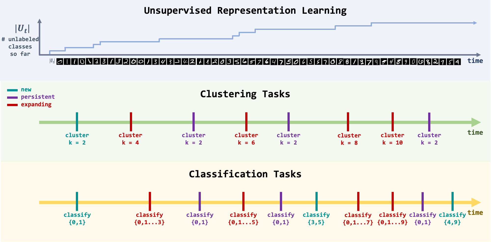

## Unsupervised Progressive Learning and the STAM Architecture
PyTorch code for the IJCAI'21 paper:\
**Unsupervised Progressive Learning and the STAM Architecture**\
**_[James Smith]_**, **_[Cameron Taylor]_**, Seth Baer, [Constantine Dovrolis]\
International Joint Conference on Artificial Intelligence (IJCAI), 2021\
[[arXiv]]
<p align="center">

</p>

## Abstract
We first pose the Unsupervised Progressive Learning (UPL) problem: an online representation learning problem in which the learner observes a non-stationary and unlabeled data stream, learning a growing number of features that persist over time even though the data is not stored or replayed. To solve the UPL problem we propose the Self-Taught Associative Memory (STAM) architecture. Layered hierarchies of STAM modules learn based on a combination of online clustering, novelty detection, forgetting outliers, and storing only prototypical features rather than specific examples. We evaluate STAM representations using clustering and classification tasks. While there are no existing learning scenarios that are directly comparable to UPL, we compare the STAM architecture with two recent continual learning models, Memory Aware Synapses (MAS) and Gradient Episodic Memories (GEM), after adapting them in the UPL setting. 


## Requirements
Intended for Ubuntu 18.04 and Python3-dev

To install Python 3 requirements:

```setup
sudo apt update
sudo apt install -y libsm6 libxext6 libxrender-dev
python3 -m venv .stam
source .stam/bin/activate
pip install -r requirements.txt
```

Download datasets from https://drive.google.com/file/d/1CLohFBp-uKiP35O_NtGvl9nPxnqlzijz/view?usp=sharing and unzip into this directory as datasets/

## Results

Our model achieves the following performance on :

### Classification
#### [Continual Image Classification on MNIST]

| Model name         | P1 Accuracy | P2 Accuracy | P3 Accuracy | P4 Accuracy | P5 Accuracy |
| ------------------ | ----------- | ----------- | ----------- | ----------- | ----------- |
|       STAM         |     97.6    |     97.4    |     96.2    |     95.0    |     91.2    |

#### [Continual Image Classification on SVHN]

| Model name         | P1 Accuracy | P2 Accuracy | P3 Accuracy | P4 Accuracy | P5 Accuracy |
| ------------------ | ----------- | ----------- | ----------- | ----------- | ----------- |
|       STAM         |     88.0    |     81.0    |     78.6    |     76.6    |     72.4    |

#### [Continual Image Classification on CIFAR-10]

| Model name         | P1 Accuracy | P2 Accuracy | P3 Accuracy | P4 Accuracy | P5 Accuracy |
| ------------------ | ----------- | ----------- | ----------- | ----------- | ----------- |
|       STAM         |     77.1    |     61.1    |     43.7    |     37.1    |     34.6    |

### Clustering

#### [Continual Image Clustering on MNIST]

| Model name         | P1 Accuracy | P2 Accuracy | P3 Accuracy | P4 Accuracy | P5 Accuracy |
| ------------------ | ----------- | ----------- | ----------- | ----------- | ----------- |
|       STAM         |     99.6    |     97.9    |     95.6    |     92.7    |     85.3    |

#### [Continual Image Clustering on SVHN]

| Model name         | P1 Accuracy | P2 Accuracy | P3 Accuracy | P4 Accuracy | P5 Accuracy |
| ------------------ | ----------- | ----------- | ----------- | ----------- | ----------- |
|       STAM         |     88.8    |     74.7    |     68.1    |     65.1    |     56.7    |

#### [Continual Image Clustering on CIFAR-10]

| Model name         | P1 Accuracy | P2 Accuracy | P3 Accuracy | P4 Accuracy | P5 Accuracy |
| ------------------ | ----------- | ----------- | ----------- | ----------- | ----------- |
|       STAM         |     65.5    |     51.1    |     38.8    |     33.5    |     30.4    |

## Contributing
MIT License

## Acknowledgement
This work is supported by the Lifelong Learning Machines (L2M) program of DARPA/MTO: Cooperative Agreement HR0011-18-2-0019.
## Citation
If you found our work useful for your research, please cite our work:

        @article{smith2021unsupervised,
             title={Unsupervised progressive learning and the {STAM} architecture},
             author={Smith, James and Taylor, Cameron  and Baer, Seth and Dovrolis, Constantine},
             journal={arXiv preprint arXiv:1904.02021},
             year={2021},
             note={Accepted for publication at IJCAI 2021}
        }

[James Smith]: https://jamessealesmith.github.io/
[Cameron Taylor]: https://www.linkedin.com/in/cameron-taylor95/
[Constantine Dovrolis]: https://www.cc.gatech.edu/fac/Constantinos.Dovrolis/
[arXiv]: https://arxiv.org/abs/1904.02021
